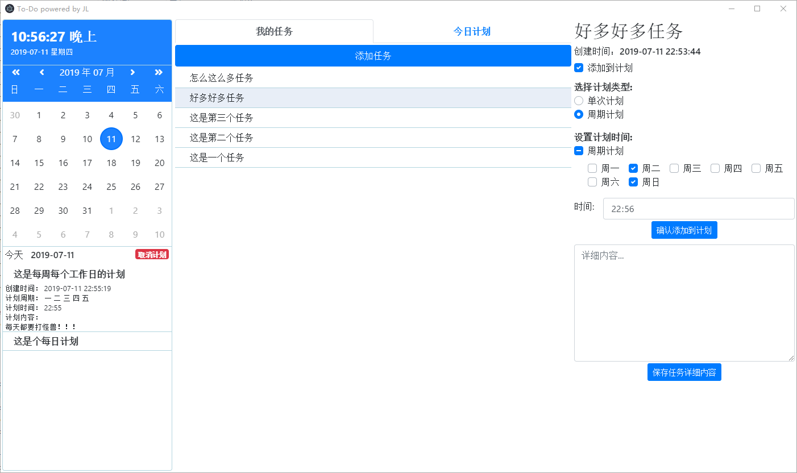
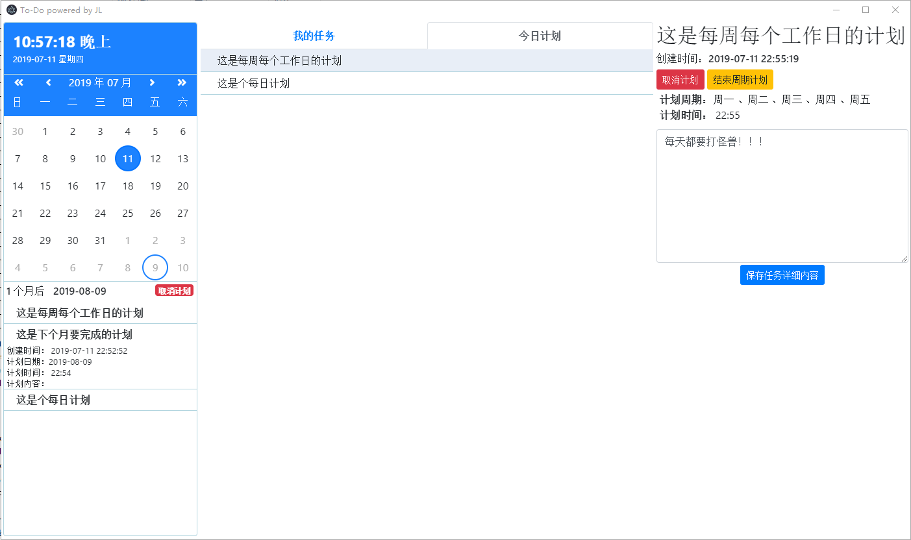

# remind-vue
基于electron-vue编写的提醒工具

- 如果有node环境可以直接下载编译运行，编译命令在[package.json](package.json)文件中

- 如果是Windows用户没有node环境则可以直接通过[百度网盘](https://pan.baidu.com/s/108XH_4KHgYIRL0r8mr0peg)（提取码：top9）下载编译好的版本，mac以及Linux用户则需要自行编译